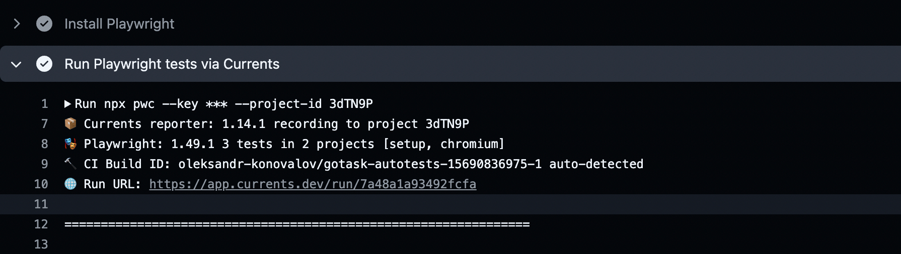

# Autotests

Workspace for storing all staff related to autotests,

## Requirements:

- node version `^20.11`
- npm version `^10.2.4`

## Setup and running E2E tests locally (2 options)

#### Specific E2E test

1. Run ```npm i``` for installing dependencies
2. Open (or create if don't exist) in the root **.env** file and set the environment variables
3. ```npx playwright test testName.spect.ts``` where **testName.spect.ts** is the name of the test file
4. Then the process of running tests will be displaying in the terminal
5. Once the tests have passed, you can use the ```npx playwright show-report``` command to see the report. If the tests fail, the report will open automatically (press Ctrl+C to close the report).

#### Bunch of test

1. Run ```npm i``` for installing dependencies
2. To run all tests ```npx playwright test``` (to stop running, press Ctrl+C)
3. There is a several way to run bunch of tests in Playwright:
    1. To run the exact folder ```npx playwright test ./tests/customer/create-order ``` where **./tests/customer/create-order** is the path to the folder
    2. [Playwright tags](https://playwright.dev/docs/test-annotations#tag-tests)
3. Then the process of running tests will be displaying in the terminal

## Running E2E tests on CI

We have GitHub actions pipelines for running e2e test

1. Open [**gotask-autotests**](https://github.com/oleksandr-konovalov/gotask-autotests) project in **Gitgub**
2. Go to Actions tab
3. Select 'Playwright Tests' workflow
4. Click on 'Run workflow' button and select the branch you want to run tests on
5. Provide tags to run tests with Playwright tags (optional)
6. Open job details after it finishes
7. Test execution could be monitored at [Dashboard](https://app.currents.dev/) / test results can be downloaded as an HTML report if default reporter is used

There is also a link in the job logs (e.g. 🌐 Run URL: https://app.currents.dev/run/aaaaaaaa34234234)
